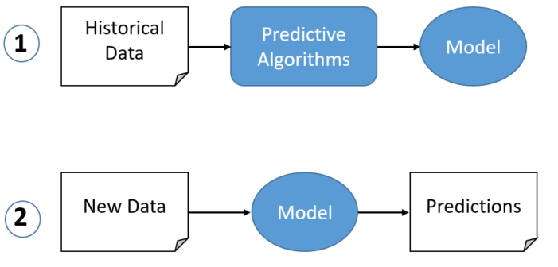
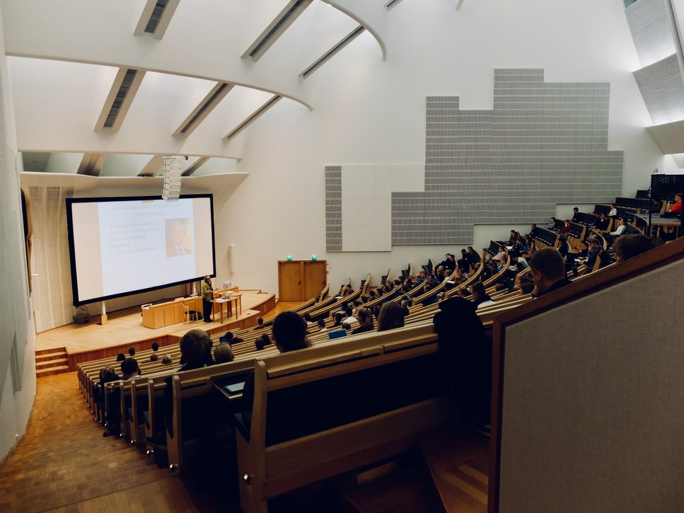
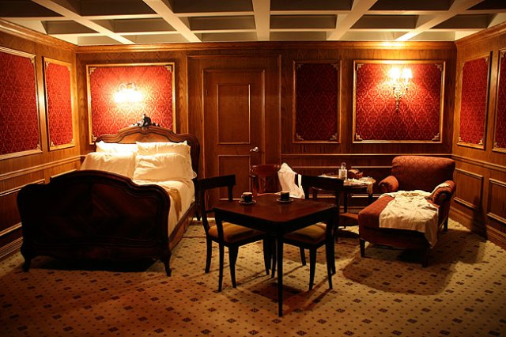

class: inverse, left, top
```{r load_packages, message=FALSE, warning=FALSE, include=FALSE} 
library(fontawesome)
```
### About Me

####  `r fa("address-card", fill = "steelblue")` Director of Data Science, University of Colorado Boulder

####  `r fa("university", fill = "steelblue")`     19 years experience in higher education
####  `r fa("school", fill = "steelblue")`     14 years on campus (Kansas, Vanderbilt, Minnesota, Colorado)
####  `r fa("database", fill = "steelblue")`     5 years in Ed-Tech/Consultancy
####  `r fa("laptop-code", fill = "steelblue")`     11 years Higher Ed Analytics/Data Science 

### Contact
####  `r fa("envelope", fill = "steelblue")`   brad.weiner@colorado.edu
####  `r fa("twitter", fill = "steelblue")`    brad_weiner
####  `r fa("desktop", fill = "steelblue")`    bradweiner.info
---
class: center, middle
background-image: url(images/flashlight.jpeg)
background-size: contain
# What is a  predictive model?
---
class: inverse, center, middle
--
### It’s an equation  

--
### Built on historical data (Beware!)

--
### Estimates the likelihood of a future outcome

--



---
class: center, middle
background-image: url(images/flashlight.jpeg)
background-size: contain
# Why Use Predictive models in higher education?
---
class: inverse, center, middle


--
### Colleges and universities are in the public trust

--
### Our research, teaching, and public engagement missions depend on us to fairly and efficiently allocate resources

---
class: inverse, center, middle
### If we don't use data, we're guessing

--
### If we're guessing, we're biased toward the _status quo_
---
class: center, middle
background-image: url(images/flashlight.jpeg)
background-size: contain
### How do we use predictive models effectively _and_ fairly?
---
class: inverse, center, middle
--

####  `r fa("check-circle", fill = "green")` Understand the use case. Are you predicting success or failure?

--

####  `r fa("check-circle", fill = "green")` Assess risk. Don't deploy if the model could deny opportunities

--

####  `r fa("check-circle", fill = "green")` Specify the model transparently and test for accuracy

--

####  `r fa("check-circle", fill = "green")` Train users on intended uses. Avoid "off-label" efforts

--

####  `r fa("check-circle", fill = "green")` Align incentives and organizational structures with the outcome

--
####  `r fa("check-circle", fill = "green")` Learn to point the outcome toward populations of interest. If you want to recruit more students from under-represented backgrounds, select that group from the distribution


---
class: center, middle
background-image: url(images/flashlight.jpeg)
background-size: contain
## Let's Predict Retention
Reminder: This is an example. Be Careful.
---

class: inverse, left, top
### Explore the Data (this is not real student data)
```{r,echo=F}
library(kableExtra)
d <- read.csv("data/retention_file_raw.csv",stringsAsFactors = F)
td <- t(head(d))
colnames(td) <- NULL
kable(td) %>% column_spec(1,bold = TRUE,) %>% kable_styling(font_size = 14)
```
---

class: inverse,left, top
### Pre-Process the Data 
```{r, echo=FALSE, message=FALSE, warning=FALSE}
library(fastDummies)
library(scales)
d <- dummy_columns(d)
d <- d %>% mutate_at(c("age","net_tuition","siblings_enrolled","peers_from_hs"), ~ scale(.))
d <- clean_names(d)
td <- t(head(d))
colnames(td) <- NULL
kable(td) %>% kable_styling(font_size = 13) %>% column_spec(1,bold = T)
```
---
class: inverse, left, top
### Split Into Training/Test Sets
```{r echo=FALSE, message=FALSE, warning=FALSE}
library(janitor)
set.seed(1876)

split <- initial_split(d, strata = retained)
retn_train <- training(split)
retn_test  <- testing(split)

kable(tabyl(retn_train$retained))

kable(tabyl(retn_test$retained))
```
---
class: inverse, left, top
### Build Basic Regression Model  
(reminder, I only have 8 minutes)
```{r echo=FALSE, message=FALSE, warning=FALSE, r,echo=T}
mod.1 <- glm(retained ~  #<<
               total_peer_group + #<<
               net_tuition + #<<
               sex_female + #<<
               income_group_no_aid, #<<
             data = retn_train, #<<
             family = "binomial") #<<
```
---
class: inverse, left, top
### Review and Interpret the Results

```{r, echo=FALSE, message=FALSE, warning=FALSE}
# kable(exp(mod.1$coefficients),col.names = NULL) %>% kable_styling(font_size = 15)
kable(tidy(mod.1,exponentiate = TRUE),digits = 3) %>% kable_styling() %>%
  row_spec(5, bold = T, color = "white", background = "green") %>%
  row_spec(4, bold = T, color = "white", background = "green") %>%
  row_spec(2, bold = T, color = "white", background = "red")
```

--
### Interpretation 

Students in the Income No Aid Group are 2.992 times more likely to retain than those in the baseline group when controlling for other features  


--
Female Students 17.5 times more likely to retain than those in the baseline group when controlling for other features

---
class: inverse, left, top, center
### Make New Predictions on Out of Sample Data
```{r echo=FALSE, message=FALSE, warning=FALSE, paged.print=FALSE}
library(ggthemes)
library(ggeasy)

cugoldtet <- c("#CFB87C",
               "#7CCF8F",
               "#7C93CF")

predictions <- predict(mod.1, 
                       type = "response",
                       newdata = retn_test) #<<

retn_test$predictions <- round(predictions,digits = 2) 
retn_test <- retn_test %>% 
  mutate(quartile = ntile(predictions,3))
  


ggplot(data = retn_test ,aes(x = predictions,fill=as.factor(quartile))) +
  geom_histogram(binwidth = 0.01,bins = 50) +
  ggthemes::theme_tufte() +
  scale_fill_manual(values = cugoldtet) +
  ggeasy::easy_remove_legend() +
  ggeasy::easy_x_axis_labels_size(size = 14) +
  ggeasy::easy_x_axis_title_size(size = 14) +
  ggeasy::easy_y_axis_labels_size(size = 14) +
  ggeasy::easy_y_axis_title_size(size = 14)
```
---
class: inverse, left, top, center
### Allocate Scarce Resources With Interventions/Programming

#### *THIS* is where your model goes from an _equation_ to an intervention

```{r echo=FALSE, message=FALSE, warning=FALSE, paged.print=FALSE}
library(waffle)
library(ggplot2)
library(tidyverse)
library(magrittr)
library(hrbrthemes)
library(forcats)

cugoldtet <- c("#CFB87C",
               "#7CCF8F",
               "#7C93CF",
               "#CF7CBD")

retn.agg <- retn_test %>%
    group_by(quartile) %>%
    summarise(values = n()) %>%
    mutate(policy_label = case_when(quartile == 1 ~ "Likely",
                                    quartile == 2 ~ "Medium",
                                    quartile ==3 ~ "Unlikely"),
           policy_label = factor(policy_label,levels = c("Unlikely","Medium","Likely"))) %>% 
    as.data.frame(.)

#table(retn.agg$policy_label)

ggplot(retn.agg, aes(label = policy_label, values = values,color=policy_label)) +
    geom_pictogram(n_rows = 10, make_proportional = T,inherit.aes = T,flip = T) +
    scale_color_manual(
        name = NULL,
        values = cugoldtet) +
    scale_label_pictogram(
        name = NULL,
        values = c(
            Unlikely  = "user-graduate", 
            Medium  = "user-graduate",
            Likely = "user-graduate")) +
    coord_equal() +
    theme_ipsum_rc(grid="") +
    theme_enhance_waffle() +
    theme(legend.key.height = unit(2.25, "line")) +
    theme(legend.text = element_text(size = 14, hjust = 0, vjust = 0.75))
```
---
class: inverse, center

--
.pull-left[

#### Option #1

```{r echo=FALSE, message=FALSE, warning=FALSE, paged.print=FALSE}
library(waffle)
library(ggplot2)
library(tidyverse)
library(magrittr)
library(hrbrthemes)
library(forcats)

cugoldtet <- c("#CFB87C",
               "#7CCF8F",
               "#7C93CF",
               "#CF7CBD")

retn.agg <- retn_test %>%
    group_by(quartile) %>%
    summarise(values = n()) %>%
    mutate(policy_label = case_when(quartile == 1 ~ "Likely",
                                    quartile == 2 ~ "Medium",
                                    quartile ==3 ~ "Unlikely"),
           policy_label = factor(policy_label,levels = c("Unlikely","Medium","Likely"))) %>% 
    as.data.frame(.)

#table(retn.agg$policy_label)

ggplot(retn.agg, aes(label = policy_label, values = values,color=policy_label)) +
    geom_pictogram(n_rows = 10, make_proportional = T,inherit.aes = T,flip = T) +
    scale_color_manual(
        name = NULL,
        values = cugoldtet) +
    scale_label_pictogram(
        name = NULL,
        values = c(
            Unlikely  = "money-bill-alt", 
            Medium  = "chalkboard-teacher",
            Likely = "envelope-open-text")) +
    coord_equal() +
    theme_ipsum_rc(grid="") +
    theme_enhance_waffle() +
    theme(legend.key.height = unit(2.25, "line")) +
    theme(legend.text = element_text(size = 14, hjust = 0, vjust = 0.75))
```

]

--
.pull-right[

#### Option #2

```{r echo=FALSE, message=FALSE, warning=FALSE, paged.print=FALSE}
library(waffle)
library(ggplot2)
library(tidyverse)
library(magrittr)
library(hrbrthemes)
library(forcats)

cugoldtet <- c("#CFB87C",
               "#7CCF8F",
               "#7C93CF",
               "#CF7CBD")

retn.agg <- retn_test %>%
    group_by(quartile) %>%
    summarise(values = n()) %>%
    mutate(policy_label = case_when(quartile == 1 ~ "Likely",
                                    quartile == 2 ~ "Medium",
                                    quartile ==3 ~ "Unlikely"),
           policy_label = factor(policy_label,levels = c("Unlikely","Medium","Likely"))) %>% 
    as.data.frame(.)

#table(retn.agg$policy_label)

ggplot(retn.agg, aes(label = policy_label, values = values,color=policy_label)) +
    geom_pictogram(n_rows = 10, make_proportional = T,inherit.aes = T,flip = T) +
    scale_color_manual(
        name = NULL,
        values = cugoldtet) +
    scale_label_pictogram(
        name = NULL,
        values = c(
            Unlikely  = "ban", 
            Medium  = "chalkboard-teacher",
            Likely = "ban")) +
    coord_equal() +
    theme_ipsum_rc(grid="") +
    theme_enhance_waffle() +
    theme(legend.key.height = unit(2.25, "line")) +
    theme(legend.text = element_text(size = 14, hjust = 0, vjust = 0.75))
```

]

--
### Which option would you take?


---
class: center, middle
background-image: url(/images/handup.jpeg)
background-size: contain
<!-- url https://unsplash.com/photos/DRzYMtae-vA -->
<!-- Nadine Shaabana -->
### Before Deciding, Let's Talk About The Data
---

class: inverse, center, top
background-image: url(titanic.jpg)
background-size: contain
#### The data set is one of the most common in Machine Learning
---
class: inverse, left, top
```{r echo=FALSE, message=FALSE, warning=FALSE, paged.print=FALSE}
t <- read.csv("https://gist.githubusercontent.com/michhar/2dfd2de0d4f8727f873422c5d959fff5/raw/fa71405126017e6a37bea592440b4bee94bf7b9e/titanic.csv",stringsAsFactors = F)

t %<>% clean_names(.)

t.agg <- t %>%
    select(-ticket,-name,-cabin) %>%
  as.data.frame(.)


kable(head(t.agg),align = "l",caption = "Titanic") %>% column_spec(2, bold = T, color = "white", background = "green") %>% kable_styling(font_size = 12)
```

<br>
<br>
--
```{r echo=FALSE, message=FALSE, warning=FALSE, paged.print=FALSE}
d.sub <- d %>% select(student_id,retained,income_group,sex,age,siblings_enrolled,net_tuition,residency)  

kable(head(d.sub),align = "l",caption = "Titanic -> Retention") %>% kable_styling(font_size = 12) %>% column_spec(2, bold = T, color = "white", background = "green")
```
---
class: inverse,center,middle
### Titanic Model
```{r, echo=FALSE, message=FALSE, warning=FALSE}
library(fastDummies)
library(scales)
t <- read.csv("https://gist.githubusercontent.com/michhar/2dfd2de0d4f8727f873422c5d959fff5/raw/fa71405126017e6a37bea592440b4bee94bf7b9e/titanic.csv",stringsAsFactors = F)

t %<>% clean_names(.)

t.agg <- t %>%
  select(-ticket,-name,-cabin) %>%
  mutate(income_group = case_when(pclass == 1 ~ "first_class",
                                  pclass == 2 ~ "second_class",
                                  pclass == 3 ~ "third_class"),
         group_size = sib_sp + parch) %>%
  mutate_at(c("fare","age"), ~ scale(.)) %>%
  as.data.frame(.)

t.agg %<>% dummy_columns(.,select_columns = c("sex","income_group"))


mod.2 <- glm(survived ~  #<<
               group_size + #<<
               fare + #<<
               sex_female + #<<
               income_group_first_class, #<<
             data = t.agg, #<<
             family = "binomial") #<<
```

```{r echo=FALSE, message=FALSE, warning=FALSE, paged.print=FALSE}
kable(tidy(mod.2,exponentiate = TRUE),digits = 3) %>% kable_styling() %>%
  row_spec(5, bold = T, color = "white", background = "green") %>%
  row_spec(4, bold = T, color = "white", background = "green") %>%
  row_spec(2, bold = T, color = "white", background = "red")
```

--
### Interpretation 

--
High income passengers in first class were more likely to survive because their cabins were closer to lifeboats


--
Female passengers were more likely to survive because social norms of the day put them first

---
class: inverse, center, middle
--
### Who "succeeds" in higher education is...


--
.pull-left[


##### Structural


]

--
.pull-right[


##### Cultural


]

---
class: inverse, center,middle
### As educators we should _appropriately_ use data to allocate limited resources

### That means we can...
---
class: inverse, center,middle

--
.pull-left[


##### Reproduce the Past



]

--
.pull-right[

##### Build Bigger Boats


]

---
class: center, middle
### Let's build bigger boats
---
class: center, middle
background-image: url(images/flashlight.jpeg)
background-size: contain
## Thanks
## Code and Slides available at
## [bradweiner.info/talk](https://bradweiner.info/talk/)

